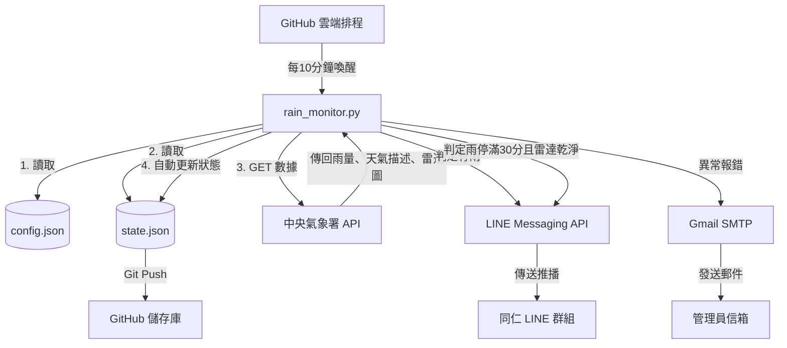

# 🌧️ 專案重要記憶與背景上下文 (AI Context)

這份檔案紀錄了「廠區天氣廣播」專案的最新核心架構與重要邏輯，旨在幫助 AI 在新的對話中能快速接手開發。

---

## 📌 專案架構
- **核心目標**：定時監控台南市安南區的天氣，將結果輸出至 GitHub 並透過 **Web Dashboard 靜態網頁**提供現場人員隨時查看是否需要加蓋帆布（LINE 通知已依需求停用）。
- **運行環境**：部署於 GitHub 儲存庫 (`fuyoung205122/company-line-notify`)，透過 GitHub Actions 排程定時執行（每 10 分鐘一次，避開整點：於每小時的 2, 12, 22, 32, 42, 52 分啟動）。
- **依賴外部服務**：
  - **主要天氣源**：中華民國中央氣象署 API (包含 `O-A0002-001` 雨量計、`O-A0003-001` 天氣現象、`O-A0058-001` 雷達回波圖分析)。
  - **備援天氣源**：Open-Meteo API (當氣象署 API 斷線或異常時自動切換)。
  - **網頁代管**：GitHub Pages (專案已設為 Public，直接利用 `fuyoung205122.github.io/company-line-notify/` 靜態發布)。
  - **Gmail SMTP**：系統發生例外錯誤時，寄送 Email 警告信給管理員。

---

## 📂 核心檔案說明
- `rain_monitor.py`：主程式邏輯，包含氣象數據抓取、雷達圖像素分析（numpy 遮罩計算）、時間與假日判斷、狀態比對及日誌紀錄。
- `config.json`：存放地理位置（經緯度、測站與雷達畫素座標）、錯誤通知收件人、**東陽 2026 行事曆設定**以及 `enable_line_notifications` (目前設為 false)。
- `state.json`：紀錄機器人當前狀態，包含 `is_covered` (目前是否判定為蓋上帆布狀態)、`last_rain_time` (最後一次下雨的時間戳記) 及 `last_reset_date` (最後一次跨日重置的日期)。
- `index.html` / `app.js` / `style.css`：V2 新增的 Web Dashboard 前端靜態網頁，直接讀取 `state.json` 與 `history_log.csv` 顯示即時動態與歷史紀錄。
- `test_rain_monitor.py`：本地單元測試腳本，使用 Python 內建 unittest 庫，可在不上傳 GitHub 的情況下直接測試 API 模擬與 JSON 解析。
- `.github/workflows/monitor.yml`：定義 GitHub Actions 執行排程與環境變數注入.
- `system_architecture.md`：系統架構圖說明文件，內含 Mermaid 架構圖。
- `system_architecture.mermaid`：Mermaid 格式的系統架構圖定義檔。
- `2026年東陽行事曆_copy.pdf`：東陽 2026 官方行事曆參考文件。

---

## ⚙️ 關鍵業務邏輯與規則
1. **運作時間**：僅在 **07:30 到 19:30** 之間進行檢查。
2. **假日排除規則**：
   - 預設排除週末（週六、週日不執行）。
   - **東陽行事曆**：自 `config.json` 的 `calendar_2026` 欄位讀取，排除所有國定連續假日，但對 12/19 (六) 現場補班日特例放行。
### 3. 下雨（加蓋帆布）判定
系統每 15 分鐘執行一次，滿足以下任一條件即判定為降雨，並發送 `cover` 通知：
1. **雨量計顯示有雨**：安南測站雨量大於 0 或為 T (微量)。
2. **雷達回波大範圍降雨**：5km 半徑內，回波像素點數 >= 10（`echo_pixel_threshold_cover`）。
3. **雷達回波強烈微爆流**：5km 半徑內，即使範圍極小，只要「最大 dBZ」>= 35（`max_dbz_threshold_cover`，通常對應黃色大雨）。

### 4. 停雨（解除加蓋）判定
目前處於「加蓋」狀態時，必須 **同時滿足** 以下三個條件，才會解除加蓋並發送 `uncover` 通知：
1. **雨量計無雨**：安南測站雨量為 0。
2. **雷達回波無雲層接近**：5km 半徑內，回波像素點數 < 5（`echo_pixel_threshold_uncover`），且最大 dBZ < 30（`max_dbz_threshold_uncover`）。
3. **持續停雨 30 分鐘**：距離最後一次判定為下雨的時間，必須超過 1800 秒。
4. **狀態重置**：每日跨日後第一次執行時，會自動將 `state.json` 恢復初始狀態，確保當日重新開始計算。

### 5. 全紀錄觀測日誌 (歷史回溯機制)
為了未來能科學化回溯與精準調校參數，系統 **每一次執行** 皆會寫入一筆完整的觀測紀錄至 `history_log.csv`，不再受限於智能過濾。
- **紀錄欄位**包含：`執行時間`, `雨量值`, `雷達點數(2km)`, `雷達點數(5km)`, `最大dBZ`, `符合Cover條件`, `符合Uncover條件`, `最終通知結果`。

---

## 🗺️ 系統架構圖

---

## 🛡️ 系統穩定性機制
- **API 請求逾時處理**：所有呼叫外部 API (`requests.post`, `requests.get`) 皆加上 `timeout=10`，避免服務卡死。
- **手動覆蓋開關**：設定檔內有 `enable_line_notifications` 參數，可於緊急狀況時暫停 LINE 推播。

## 🔑 環境變數 (Secrets)
開發或測試時需確保 GitHub Secrets 或本地 `secrets.json` 中配置有以下變數：
- `LINE_CHANNEL_ACCESS_TOKEN`：LINE 官方帳號 Token
- `LINE_GROUP_ID`：發送目標群組 ID (支援逗號分隔多群組)
- `CWA_API_KEY`：中央氣象署開放資料 API 金鑰
- `GMAIL_USER` / `GMAIL_APP_PASSWORD`：報警信件發送帳號與應用程式密碼
