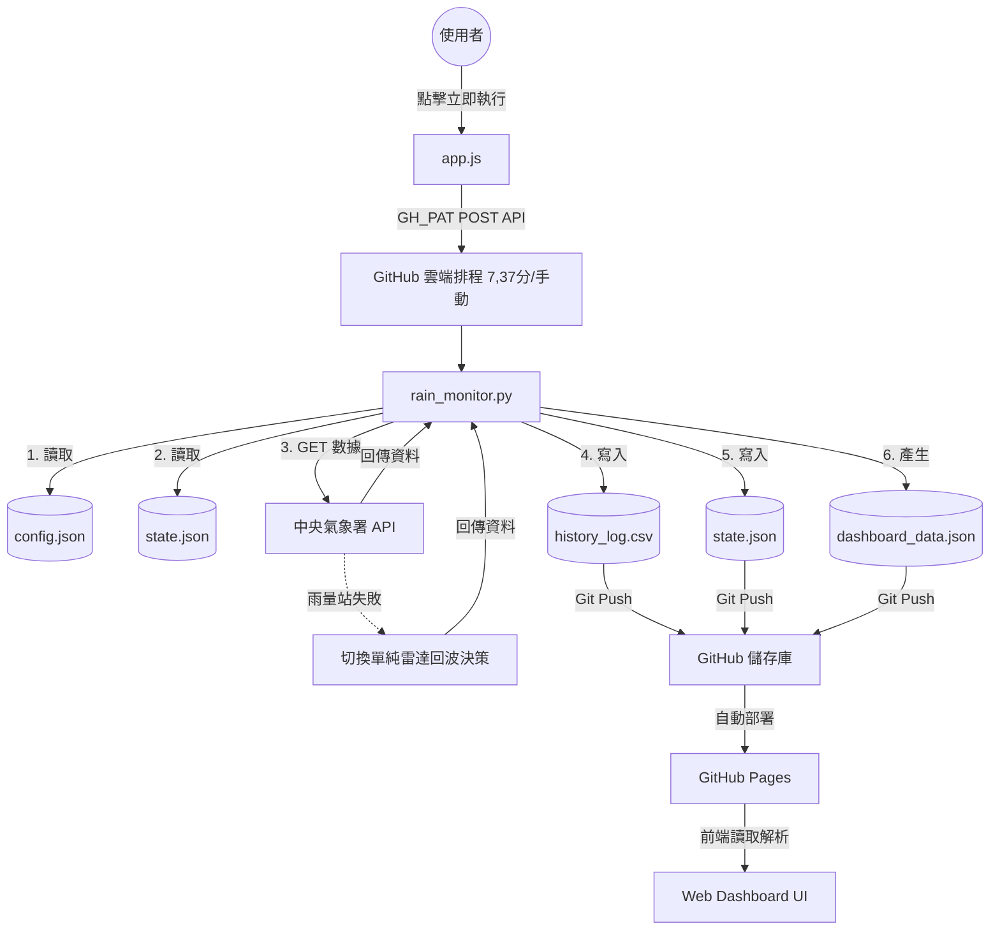

# 🌧️ 專案重要記憶與背景上下文 (AI Context)

這份檔案紀錄了「廠區天氣廣播」專案的最新核心架構與重要邏輯，旨在幫助 AI 在新的對話中能快速接手開發。
目前已升級為 **V2 最終穩定版（雙軌並行、前端檢核架構）**，並移除了所有 LINE Notify 相關的依賴。

---

## 📌 專案架構
- **核心目標**：定時監控台南市安南區的天氣，將結果輸出至 GitHub 並透過 **Web Dashboard 靜態網頁** 作為唯一真理來源，提供現場人員隨時查看是否需要加蓋帆布。
- **運行環境**：部署於 GitHub 儲存庫 (`fuyoung205122/company-line-notify`)，透過 GitHub Actions 排程定時執行（每 30 分鐘一次，避開整點：於每小時的 7, 37 分啟動）。支援前端 `workflow_dispatch` 立即觸發執行。
- **依賴外部服務**：
  - **主要天氣源**：中華民國中央氣象署 API。
  - **備援天氣源**：當雨量站故障時，單獨以雷達回波作為判斷依據。
  - **網頁代管**：GitHub Pages。
  - **Gmail SMTP**：系統發生致命錯誤時，寄送 Email 警告信給管理員。

---

## 📂 核心檔案說明
- `rain_monitor.py`：主程式邏輯，包含氣象數據抓取、雷達圖像素分析、時間假日判斷，並產生 `dashboard_data.json` 與寫入歷史紀錄。包含環境變數啟動診斷與錯誤安全降級機制。
- `config.json`：存放地理位置、信件收件人、東陽 2026 行事曆設定及相關門檻。
- `state.json`：紀錄機器人當前狀態，包含 `is_covered`、`last_rain_time`、健康度統計 (`total_runs`, `successful_runs`) 及 `last_status`。
- `dashboard_data.json`：前端 Dashboard 的單一真理來源，包含即時狀態、各項數據、健康度與完整判斷依據 (reasons)。
- `history_log.csv`：歷史紀錄檔，包含所有判定數據及判斷原因（第 9 欄）。
- `index.html` / `app.js` / `style.css`：負責渲染 `dashboard_data.json`，並內建時間衰變檢測、健康度計算、手動立即更新，以及安全的 GitHub PAT 遠端觸發機制。
- `.github/workflows/monitor.yml`：定義 GitHub Actions 執行排程與 `workflow_dispatch` 觸發設定。

---

## ⚙️ 關鍵業務邏輯與規則
1. **運作時間**：07:30 到 19:30 之間進行檢查，排除週末與東陽行事曆國定假日。
2. **下雨（加蓋帆布）判定**：滿足以下任一條件即判定為降雨：
   - 雨量計顯示有雨（>0 或 T）。
   - 雷達回波 5km 內點數 >= 10。
   - 雷達回波 5km 內最大 dBZ >= 45（以 config 設定為準）。
3. **停雨（解除加蓋）判定**：處於「加蓋」狀態時，必須 **同時滿足** 以下三個條件才會解除：
   - 雨量計無雨。
   - 雷達回波無雲層接近（點數與 dBZ 低於解除門檻）。
   - 持續停雨 30 分鐘（距離最後一次下雨超過 1800 秒）。
4. **前端時間延遲檢測 (Time Decay Detection)**：前端 `app.js` 會自動比較 `dashboard_data.json` 的更新時間與當前時間：
   - **0~44 分鐘**：🟢 正常運作。
   - **45~89 分鐘**：🟡 資料延遲 (排程可能壅塞)。
   - **90 分鐘以上**：🔴 系統異常 (排程可能已停止)。
5. **系統健康度與重置**：
   - 根據 `successful_runs / total_runs` 比例，前端渲染健康度（<10次為蒐集中，>=99%優秀，>=95%注意，<95%異常）。
   - 若後端偵測到從 `error` 狀態恢復為 `normal`，會自動將執行次數重置歸零，避免歷史錯誤永久影響健康度。
6. **前端手動更新與執行**：
   - **🔄 立即更新**：重新 Fetch 最新 JSON 狀態。
   - **🚀 立即執行檢查**：前端提示輸入 `GH_PAT` (存於 localStorage)，透過 API 呼叫 `workflow_dispatch` 強制觸發 Actions 排程，並於 3 秒後開始輪詢最新 `run_id`。

---

## 🗺️ V2 雙軌並行系統架構圖

---

## 🛡️ 系統穩定性機制
- **優雅降級 (Graceful Degradation)**：若雨量站資料無法取得，系統自動切換為「單獨以雷達回波」進行降雨判斷，且 `system_status` 維持 `normal`。若雷達回波也失效，則將系統狀態設為 `error` 並發送警告。
- **防止狼來了**：一般 API 錯誤會被記錄並 `sys.exit(0)`，只有 `FileNotFoundError` 等致命 I/O 錯誤才會導致 Workflow 亮紅燈 `sys.exit(1)`。
- **信件通報**：發生致命例外錯誤時，發送 Gmail 通知給管理員。
