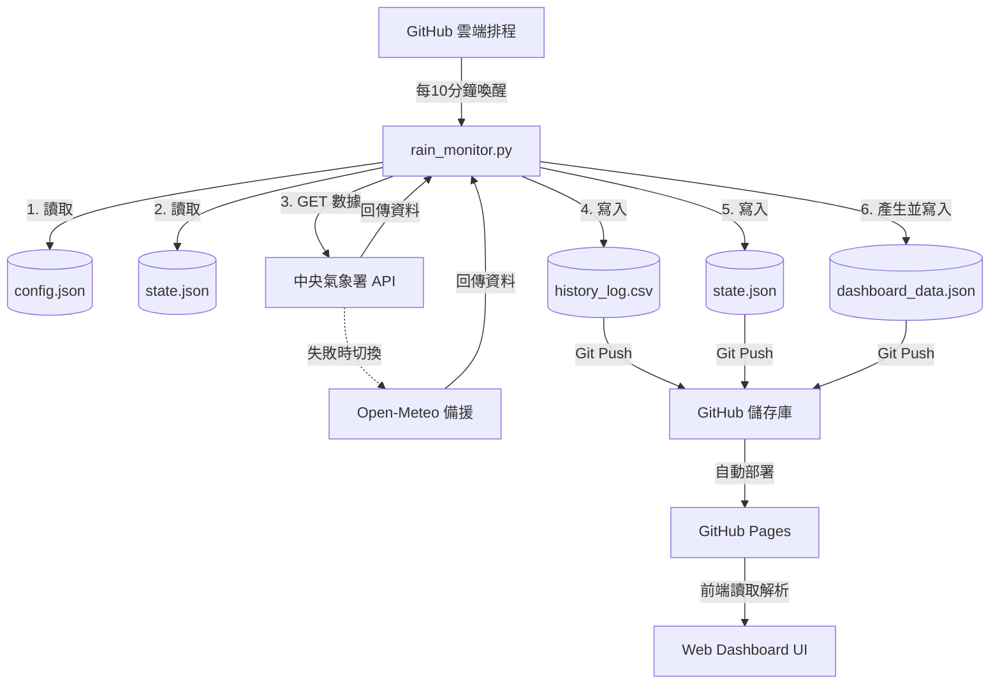

# 🌧️ 專案重要記憶與背景上下文 (AI Context)

這份檔案紀錄了「廠區天氣廣播」專案的最新核心架構與重要邏輯，旨在幫助 AI 在新的對話中能快速接手開發。
目前已升級為 **V2 雙軌並行、前端檢核架構**。

---

## 📌 專案架構
- **核心目標**：定時監控台南市安南區的天氣，將結果輸出至 GitHub 並透過 **Web Dashboard 靜態網頁** 作為唯一真理來源，提供現場人員隨時查看是否需要加蓋帆布（LINE 通知已依需求停用）。
- **運行環境**：部署於 GitHub 儲存庫 (`fuyoung205122/company-line-notify`)，透過 GitHub Actions 排程定時執行（每 10 分鐘一次，避開整點：於每小時的 2, 12, 22, 32, 42, 52 分啟動）。
- **依賴外部服務**：
  - **主要天氣源**：中華民國中央氣象署 API。
  - **備援天氣源**：Open-Meteo API。
  - **網頁代管**：GitHub Pages。
  - **Gmail SMTP**：系統發生例外錯誤時，寄送 Email 警告信給管理員。

---

## 📂 核心檔案說明
- `rain_monitor.py`：主程式邏輯，包含氣象數據抓取、雷達圖像素分析、時間假日判斷，並產生 `dashboard_data.json` 與寫入歷史紀錄。
- `config.json`：存放地理位置、信件收件人、東陽 2026 行事曆設定及相關門檻。
- `state.json`：紀錄機器人當前狀態，包含 `is_covered`、`last_rain_time` 及每日跨日重置的日期。
- `dashboard_data.json`：**V2 新增**，前端 Dashboard 的單一真理來源，包含即時狀態、各項數據與完整判斷依據 (reasons)。
- `history_log.csv`：歷史紀錄檔，包含所有判定數據及判斷原因（第 9 欄）。
- `index.html` / `app.js` / `style.css`：V2 新增的前端靜態網頁，負責渲染 `dashboard_data.json`，並內建時間衰變檢測防呆機制。
- `test_rain_monitor.py`：本地單元測試腳本。
- `.github/workflows/monitor.yml`：定義 GitHub Actions 執行排程。

---

## ⚙️ 關鍵業務邏輯與規則
1. **運作時間**：07:30 到 19:30 之間進行檢查，排除週末與東陽行事曆國定假日。
2. **下雨（加蓋帆布）判定**：滿足以下任一條件即判定為降雨：
   - 雨量計顯示有雨（>0 或 T）。
   - 雷達回波 5km 內點數 >= 10。
   - 雷達回波 5km 內最大 dBZ >= 45（以 config 設定為準）。
3. **停雨（解除加蓋）判定**：處於「加蓋」狀態時，必須 **同時滿足** 以下三個條件才會解除：
   - 雨量計無雨。
   - 雷達回波無雲層接近（點數與 dBZ 低於解除門檻）。
   - 持續停雨 30 分鐘（距離最後一次下雨超過 1800 秒）。
4. **全紀錄觀測日誌**：每一次執行皆寫入一筆完整紀錄至 `history_log.csv`，並附加「判斷原因」文字。
5. **前端時間延遲檢測 (Time Decay Detection)**：前端 `app.js` 會自動比較 `dashboard_data.json` 的更新時間與當前時間：
   - **0~15 分鐘**：🟢 正常運作。
   - **15~30 分鐘**：🟡 資料延遲 (排程可能壅塞)。
   - **30 分鐘以上**：🔴 系統異常 (排程可能已停止)。

---

## 🗺️ V2 雙軌並行系統架構圖

---

## 🛡️ 系統穩定性機制
- **API 請求逾時處理**：外部 API 皆加上 `timeout`。
- **錯誤捕捉與前端報警**：當腳本發生 Exception，會寫入帶有 `error` 狀態的 `dashboard_data.json`，讓前端立即顯示錯誤。
- **信件通報**：發生嚴重錯誤時發送 Gmail 通知給管理員。
