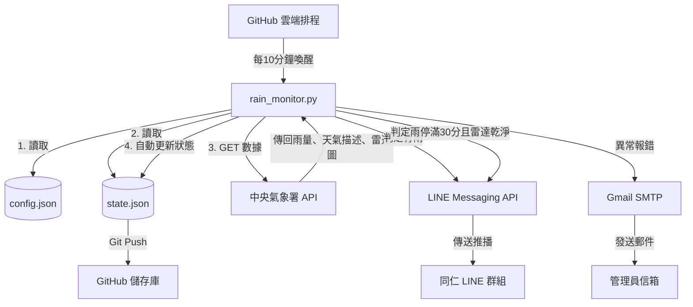

# 🌧️ 廠區降雨自動通知系統：系統架構圖 (Mermaid)

您可以直接在支援 Markdown (例如 VS Code、GitHub 或 Dify) 的預覽器中查看這張圖表。

```mermaid
graph TD
    Trigger[GitHub 雲端排程] -->|每10分鐘喚醒| Exec[rain_monitor.py]
    Exec -->|1. 讀取| Config[(config.json)]
    Exec -->|2. 讀取| State[(state.json)]
    Exec -->|3. GET 數據| CWA[中央氣象署 API]
    
    CWA -->|傳回雨量、天氣描述、雷達圖| Exec
    
    Exec -->|判定有雨| LINE[LINE Messaging API]
    Exec -->|判定雨停滿30分且雷達乾淨| LINE
    
    LINE -->|傳送推播| Users[同仁 LINE 群組]
    
    Exec -->|異常報錯| Gmail[Gmail SMTP]
    Gmail -->|發送郵件| Admin[管理員信箱]
    
    Exec -->|4. 自動更新狀態| State
    State -->|Git Push| GitHub[GitHub 儲存庫]
```
